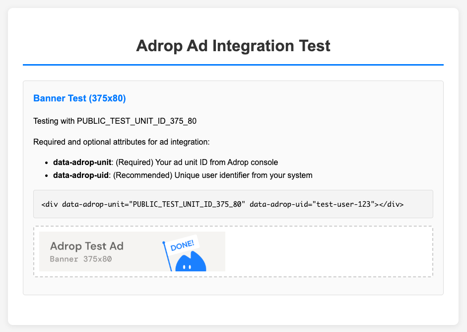

# Adrop Ad Integration for Web

A simple integration guide and test page for implementing Adrop ads on websites.

## Quick Start

1. Copy the JavaScript code from `web/request-ad.html` to your website
2. Add ad containers with required attributes
3. Ads will load automatically

## Usage

### Basic Integration

```html
<div data-adrop-unit="your_ad_unit_id" data-adrop-uid="user_123"></div>
```

### Required Script

Add this script to your HTML head:

```javascript
// Fetch ad from API
async function fetchAd(params, retries = 3) {
    const controller = new AbortController();
    const timeoutId = setTimeout(() => controller.abort(), 3000);
    
    try {
        const searchParams = new URLSearchParams(params);
        const response = await fetch(`https://api-v2.adrop.io/request/web?${searchParams}`, {
            method: 'GET',
            headers: { 'Accept': 'application/json' },
            signal: controller.signal
        });
        
        clearTimeout(timeoutId);
        
        if (!response.ok) {
            return { code: 4002, msg: `HTTP ${response.status}`, result: {} };
        }
        
        return await response.json();
    } catch (error) {
        // Retry logic and error handling
        if (retries > 0 && !controller.signal.aborted) {
            await new Promise(resolve => setTimeout(resolve, 1000));
            return fetchAd(params, retries - 1);
        }
        return { code: 4002, msg: error.message, result: {} };
    }
}

// Load ads automatically
async function loadAdropAds() {
    const elements = document.querySelectorAll('[data-adrop-unit]');
    
    for (const el of elements) {
        const unit = el.getAttribute('data-adrop-unit');
        if (!unit) continue;
        
        const adData = await fetchAd({
            unit,
            uid: el.getAttribute('data-adrop-uid'),
            lcl: navigator.language || 'en-US'
        });
        
        const { code, result } = adData;
        if (code === 0 && result.ad) {
            el.innerHTML = result.ad;
            if (result.w && result.h) {
                el.style.width = `${result.w}px`;
                el.style.height = `${result.h}px`;
            }
        }
    }
}

// Auto-initialize
document.addEventListener('DOMContentLoaded', loadAdropAds);
```

## Attributes

- `data-adrop-unit`: (Required) Your ad unit ID from Adrop console  
- `data-adrop-uid`: (Recommended) Unique user identifier from your system

## API Response Format

```json
{
    "code": 0,        // 0 = success, 4xxx = error
    "msg": "OK",      // Status message
    "result": {
        "ad": "<html>",  // Ad HTML content
        "w": 375,        // Width in pixels
        "h": 80          // Height in pixels
    }
}
```

## Error Codes

- `4000`: Invalid ad unit ID - check unit configuration
- `4001`: No active ad campaigns - retry later  
- `4002`: No matching ads available - implement fallback content
- `4003`: Invalid parameters - verify request parameters

## Features

- Direct API integration with https://api-v2.adrop.io/request
- Automatic browser locale detection
- Dynamic ad sizing based on API response

## Test

Open `web/request-ad.html` in a browser to see the integration in action with test unit `PUBLIC_TEST_UNIT_ID_375_80`.



## Documentation

For more detailed information about Adrop API integration, please visit our [Developer Guide](https://help.adrop.io/developer-guide/adrop-api/rest-api).

## Live Demo

- [Ad Integration Test](https://openrhapsody.github.io/adrop-integration/web/request-ad.html)
- [AdBlock Detection Test](https://openrhapsody.github.io/adrop-integration/web/ad-block.html)
